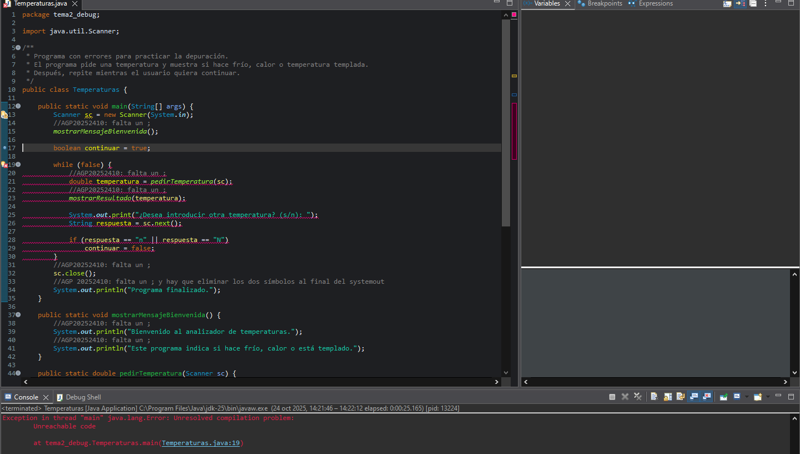
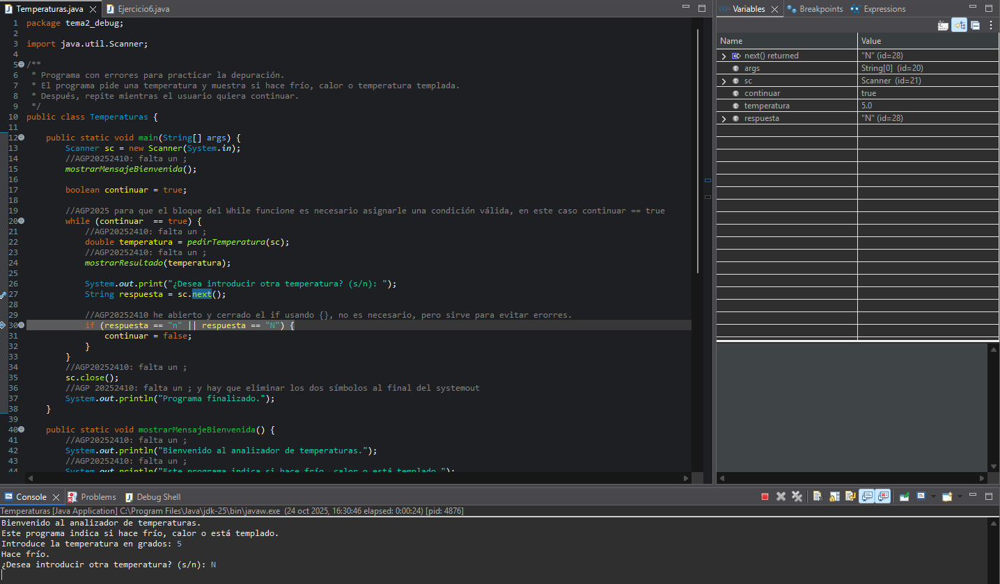
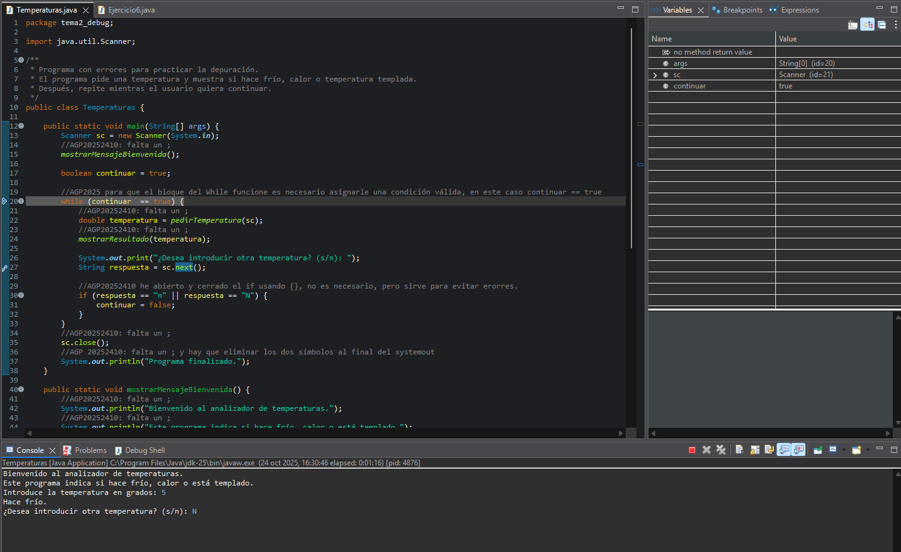

# ED2425-U2P6
Practica 6 de la unidad 2 de Entorno de Desarrollo

1. Los comentarios están realizados en el mismo código, todos los errores de sintaxis han sido ";" faltantes salvo en la línea 31, en la que habían símbolos de comentarios que sobraban (más concretamente */).

2. He encontrado 2 errores:

- El primero lo he podido ver al intentar ejecutar el programa, ocurre al realizar antes de empezar el bloque while, ya que este no tiene una condición válida, sino que tiene simplemente un false.

- El segundo error ocurre al intentar finalizar el programa, ocurre ya que al intentar comparar 2 valores que son string con el operador "==" siempre dará false ya que este operador no sirve para los valores de String, para esto se usa el método equals (en este caso equalsIgnoreCase para realizar en vez de 2 comparaciones con el operador "||" realizar una única comparación).

En esta captura se puede observar la vista de depuración ANTES de llegar a la línea problemática:

En esta captura se puede observar que el bloque condicional no se ejecuta y por tanto el programa no puede finalizar de manera normal:

3. Creo que la documentación es muy necesaria tanto cuando se desarrolla con un grupo de trabajo como cuando se trabaja en solitario, principalmente para siempre tener referencias sobre lo que hace cada parte del código, y aunque pueda parecer que al una persona desarrollar por su cuenta no necesitará de esta, si el proyecto se vuelve muy grande puede darse el caso que cuando intente refactorizar código se encuentre con partes del proyecto que no recuerde como funcionan. 
